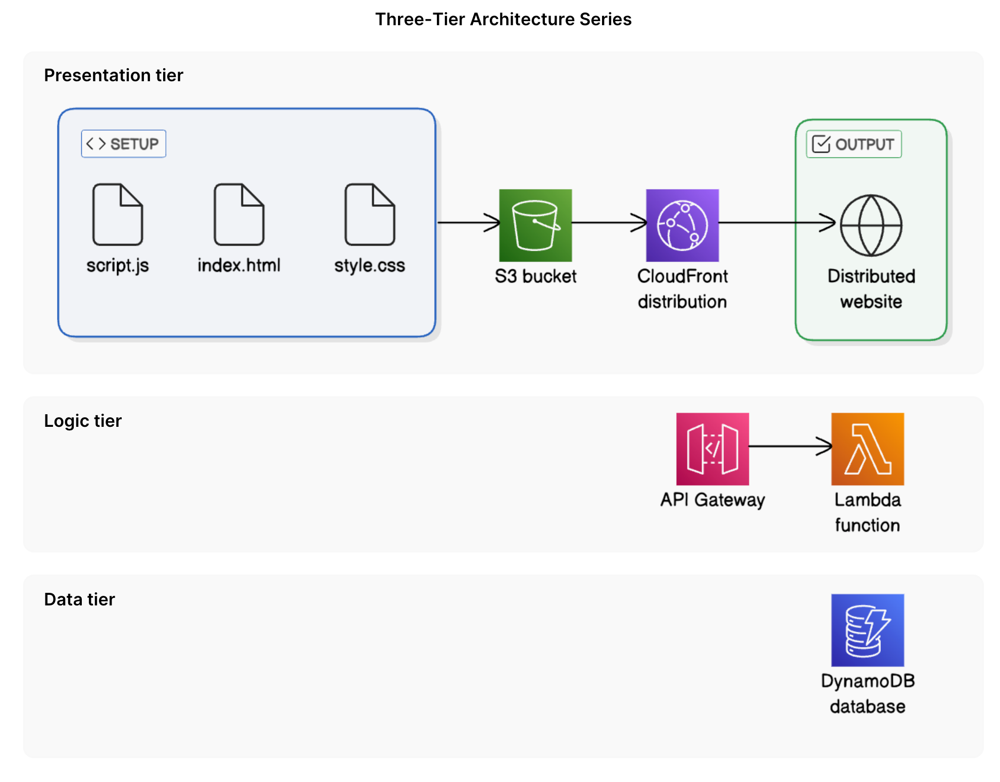

# Build a Three-Tier Web App on AWS

This repository contains the code and architecture documentation for a scalable, secure, and serverless **Three-Tier Web Application** built on Amazon Web Services (AWS).

## Architecture Overview

This project demonstrates a decoupling of concerns across three distinct layers:
1. **Presentation Tier (Frontend)**: A static website (HTML, CSS, JavaScript) hosted securely on **Amazon S3** and distributed globally with low latency using **Amazon CloudFront**.
2. **Logic Tier (Backend API)**: Serverless microservices running on **AWS Lambda**, exposed via **Amazon API Gateway** REST endpoints.
3. **Data Tier (Database)**: A fast, flexible NoSQL database powered by **Amazon DynamoDB** to store and retrieve persistent application data.

---

## AWS Services Used

- **Amazon S3**: Hosts static web assets (`index.html`, `style.css`, `script.js`).
- **Amazon CloudFront**: Acts as a Content Delivery Network (CDN) to cache and serve the frontend assets globally.
- **Origin Access Control (OAC)**: Secures S3 bucket access, ensuring the bucket is private and only accessible via CloudFront.
- **Amazon API Gateway**: Routes HTTP requests from the browser to the backend logic layer.
- **AWS Lambda**: Executes backend logic in Python on-demand.
- **Amazon DynamoDB**: Stores schema-less JSON-like items representing application entities.
- **AWS IAM**: Manages fine-grained, least-privilege permissions between tiers.

---

## Setup & Deployment Steps

### 1. Presentation Tier (Frontend)
- Create a private S3 bucket.
- Upload the frontend files (`index.html`, `style.css`, `script.js`).
- Configure an Amazon CloudFront distribution pointing to the S3 bucket as its origin.
- Secure S3 using Origin Access Control (OAC) and update the S3 bucket policy to allow read permissions *only* to CloudFront.

### 2. Data Tier (Database)
- Create a DynamoDB table with a Partition Key (e.g., `id`).
- Seed sample records into the table.

### 3. Logic Tier (Backend API)
- Create an AWS Lambda function with code to query the DynamoDB table.
- Attach an IAM execution role with a policy allowing the function to scan/read items from the DynamoDB table.
- Set up a REST API in Amazon API Gateway.
- Create a resource and a `GET` method integrated with the Lambda function.
- Enable **CORS** on the API Gateway resource to allow cross-origin requests from the CloudFront frontend.
- Deploy the API to a `prod` stage to generate an **Invoke URL**.

### 4. Integration
- Update your local `script.js` file, substituting the `const API_URL` with your API Gateway Invoke URL.
- Re-upload `script.js` to S3.
- Run a CloudFront Invalidation (`/*`) to purge cached files and serve the updated script to clients.

---

## How to Run & Test
1. Access the web app using your **CloudFront Domain Name** (e.g., `https://dxxxxxxxxxx.cloudfront.net`).
2. Open your browser's Developer Tools (`F12`) to verify there are no active CORS or mixed-content console errors.
3. Click the interactive buttons on the frontend to fetch data dynamically from DynamoDB through API Gateway and Lambda.

---

## Key Learnings
- **Decoupled Architecture**: Gained experience separating presentation from processing and data storage, making the system highly available and independently scalable.
- **Serverless Operations**: Deployed entire backends without provisioning or managing a single virtual server.
- **Cloud Security**: Configured strict IAM policies, API CORS policies, and CloudFront OAC origin restrictions to build secure public-facing architectures.
